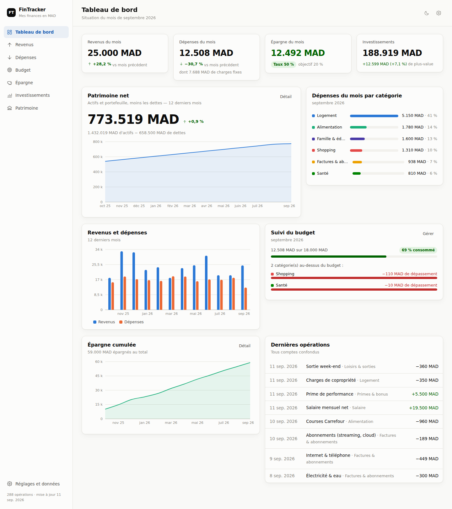

# FinTracker

Application web personnelle de gestion de finances — revenus, dépenses, budget,
épargne, investissements et patrimoine net. Devise : **MAD**. Interface en
français, pensée pour l'ordinateur et le smartphone.



## Démarrer

```bash
npm install
npm run dev      # http://localhost:5173
```

Autres commandes :

```bash
npm run build      # build de production dans dist/
npm run preview    # sert le build de production
npm run typecheck  # vérification TypeScript
```

Au premier lancement, un **jeu de données fictif** (13 mois d'historique) est
chargé automatiquement pour permettre de tester toutes les pages. Il se
remplace, se recharge ou s'efface depuis **Réglages et données**.

## Fonctionnalités

| Page | Contenu |
|---|---|
| **Tableau de bord** | Revenus, dépenses, épargne et taux d'épargne du mois, valeur des investissements, patrimoine net et son évolution, revenus/dépenses sur 12 mois, suivi du budget, épargne cumulée, dernières opérations |
| **Revenus** | Ajout / modification / suppression, montant, date, catégorie, description, répartition par catégorie, historique 12 mois, recherche et filtres |
| **Dépenses** | Idem revenus + distinction **dépenses fixes / variables**, catégories personnalisables (nom, nature, couleur) |
| **Budget** | Budget par catégorie et par mois, comparaison prévu / réel, dépassements mis en évidence, consultation des mois précédents, reprise des budgets du mois précédent |
| **Épargne** | Épargne du mois (revenus − dépenses), versements et retraits, épargne cumulée, épargne **disponible** vs **affectée à un objectif**, objectifs avec progression |
| **Investissements** | Actions, ETF, OPCVM, obligations, crypto : quantité, prix d'achat, prix actuel, plus/moins-value automatique, allocation par type, comparaison investi / valeur actuelle |
| **Patrimoine** | Actifs (liquidités, comptes, épargne, véhicules, immobilier…), dettes, patrimoine net = actifs − dettes, taux d'endettement, historique mensuel |

Transversal : recherche plein texte, filtres par période (mois, 3/6/12 mois,
année, période personnalisée) et par catégorie, thème clair/sombre, export et
import JSON des données.

## Données et persistance

Tout est stocké **dans le navigateur** (`localStorage`, clé `fintracker:state`) :
aucune donnée ne quitte l'appareil, aucun compte n'est nécessaire. L'export JSON
sert de sauvegarde et de moyen de transfert vers un autre appareil.

L'état est versionné (`version` dans `AppState`) : `src/store/persistence.ts`
contient le point d'entrée des migrations, et la couche de stockage peut être
remplacée par une API distante sans toucher aux composants.

## Architecture

Voir [`ARCHITECTURE.md`](ARCHITECTURE.md) pour le modèle de données, les règles
de calcul et l'organisation du code.

Stack : React 19 + TypeScript + Vite, Recharts pour les graphiques temporels,
CSS natif avec jetons de design (aucune dépendance UI).
